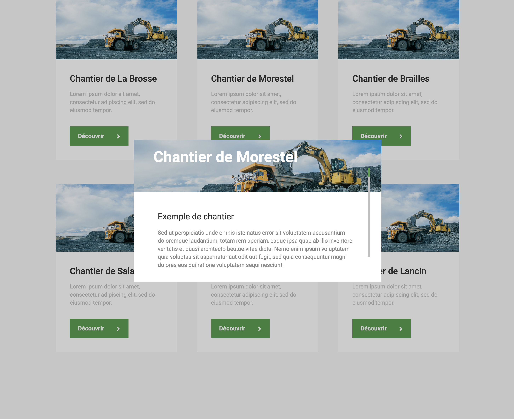

# Paillet (Wordpress + ACF + Sass + TypeScript + Javascript)

Développement d'un thème Wordpress from scratch au sein de l'agence Zelda Communication. Le but était de créer un thème de base, flexible et potentiellement réutilisable (grâce notamment à l'utilisation des Advanced Custom Fields).

Extrait de quelques pages et fonctionnalités développées par mes soins (responsive compris):

## [Menu](https://github.com/idrissdiakite/paillet-wordpress/tree/main/Menu)

Rien d'exceptionnel, la (seule) technicité a été de trouver un moyen de conserver le sous menu ouvert lorsque le titre n'est plus hover.

<a href="https://www.youtube.com/watch?v=dclFvtJVTPM" target="_blank">demo</a>

## [Contact](https://github.com/idrissdiakite/paillet-wordpress/tree/main/Contact)

Mise en place d'un devis sous forme de formulaire (avec radio bouton, checkbox, textarea, email, number etc...).  
Envoi du formulaire entièrement géré en PHP avec la méthode $\_POST.

## [Modal](https://github.com/idrissdiakite/paillet-wordpress/tree/main/Modal)

Affichage des différents chantiers de l'entreprise sous forme de grid.  
Lorsqu'on clique sur le bouton Découvrir, cela ouvre une modale avec les différentes informations associées au chantier cliqué.  
Intégration d'un slider d'images à l'intérieur de la modal + création d'une scrollbar personnalisée et dynamique.

[demo](https://www.youtube.com/watch?v=BPcJioRRMug)

## [Modal + Slider](https://github.com/idrissdiakite/paillet-wordpress/tree/main/Modal%20%2B%20Slider)

Présentation du parc matériel de l'entreprise sous forme d'images style masonry.  
Lorsqu'on clique sur le bouton loupe cela fait apparaitre un slider d'images associé au materiel cliqué.  
Intégration de flèches (droite/gauche) et de boutons afin de faire défiler le slider.

[demo](https://www.youtube.com/watch?v=FwEu9eOtlBA)

## [Slider](https://github.com/idrissdiakite/paillet-wordpress/tree/main/Slider)

Mini slider d'images afin de mettre en avant les partenaires de l'entreprise.

[demo](https://www.youtube.com/watch?v=baThG571Zn8)
